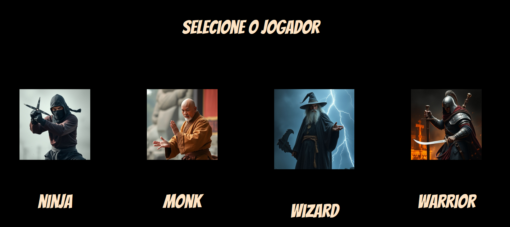
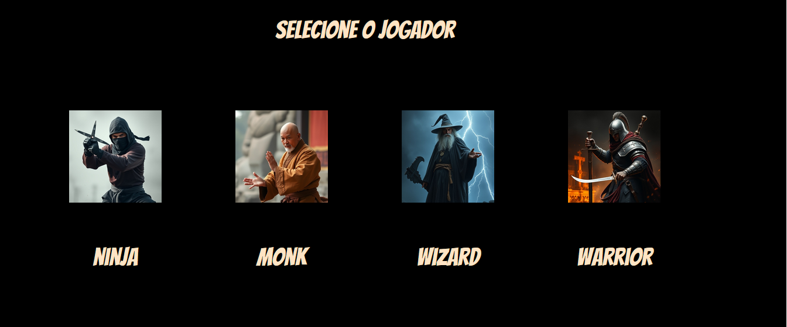
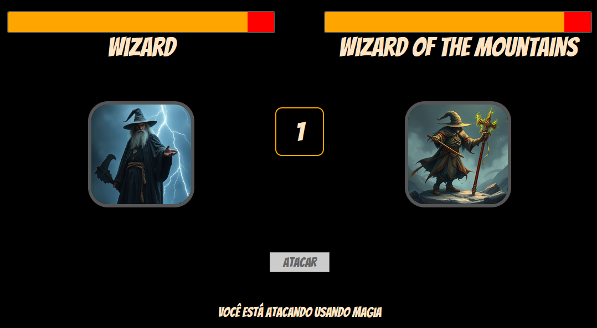

# DIO - GFT - Desafio de Jogo

Esse jogo foi desenvolvido como um desafio para um bootcamp de lógica de programação.

O desafio era criar um jogo que teria:
- Variáveis  
- Operadores  
- Laços de repetição  
- Estruturas de decisões  
- Funções  
- Classes e Objetos

além disso, deve ter um método chamado atacar que deve atender os seguientes requisitos:

- exibir a mensagem: "o {tipo} atacou usando {ataque}")  
- aonde o {tipo} deve ser concatenando o tipo que está na propriedade da classe  
- e no {ataque} deve seguir uma descrição diferente conforme o tipo, seguindo a tabela abaixo:

se mago -> no ataque exibir (usou magia)  
se guerreiro -> no ataque exibir (usou espada)  
se monge -> no ataque exibir (usou artes marciais)  
se ninja -> no ataque exibir (usou shuriken)

### desenvolvimento
O jogo foi desenvolvido em Javascript. Como melhorias eu adicionei imagens geradas por Ai.

players            
:--------------------------------------------------:

  

Eu também desenvolvi várias telas. A tela inicial é para selecionar o player.

Após a seleção do player, o inimigo é selecionado aleatoreamente.

Após a seleção do inimigo, o jogador entra na arena de luta.

A menssagem no rodapé depende da arma do player. Cada player ataca com uma arma diferente e causa um dano diferente.

Após o jogador atacar o inimigo, ele deverá esperar a vez do inimigo atacar.

O dano é determinado pala força do player multiplicado pelo dado. o Dado tem 7 possibilidades (0 - 6).

se o valor do dado for 0, o que está sendo atacado não receberá dano.
